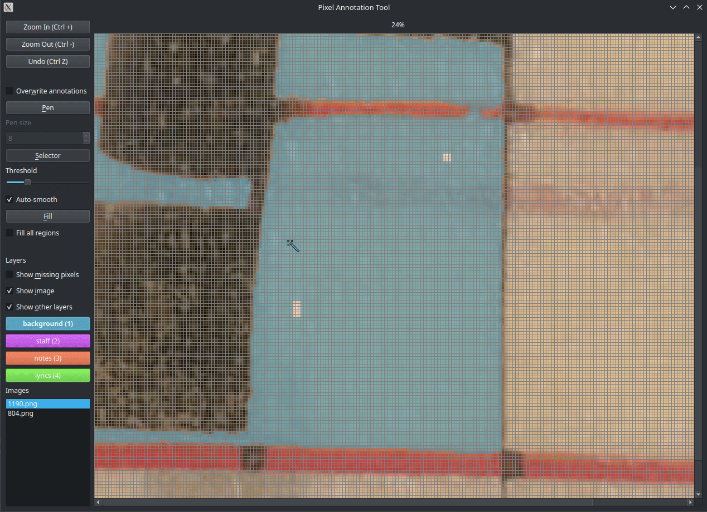
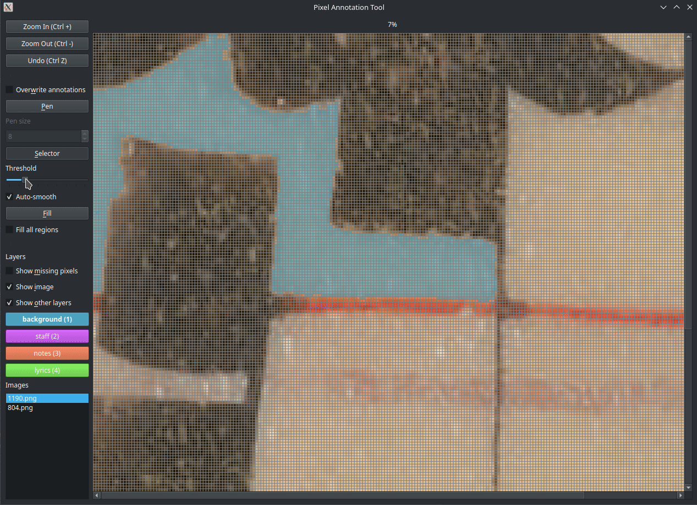
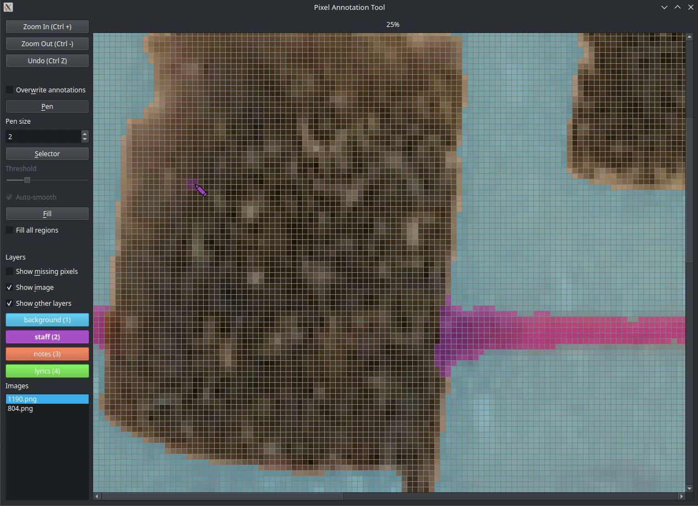

# Pixel-Level Annotator

A desktop application for pixel-wise semantic annotation of images, designed for the rapid production of dense segmentation masks. The tool supports multi-layer labelling, per-layer time tracking, an interactive autolabel service backed by ONNX inference, and an optional background web service for programmatic annotation requests.


## Citation

If you use this tool in academic work, please cite the following publication:

> Pérez-Sancho, C., Galan-Cuenca, A., Martinez-Esteso, J. P., Castellanos, F. J., & Gallego, A. J. (2025). Pixel Labeler: A Pixel-Wise Annotation Tool for Active Learning Music Recognition. *Proceedings of the 17th International Symposium on Computer Music Multidisciplinary Research*, 711–722. [https://doi.org/10.5281/zenodo.17488553](https://doi.org/10.5281/zenodo.17488553)

---

## Installation

Install the required dependencies via pip:

```bash
pip install -r requirements.txt
```

> **Note — Python version:** `tomllib` (used to parse `config.toml`) is included in the standard library from Python 3.11 onwards. On Python 3.10 the `tomli` back-port is installed automatically by the requirement above.

### Troubleshooting Qt platform plugins (Linux)

If the application fails to start with an error such as `qt.qpa.plugin: Could not load the Qt platform plugin "xcb"`, reinstall the missing system libraries:

```bash
sudo apt install --reinstall libxcb-xinerama0 libxcb-cursor0
sudo apt install --reinstall libxcb1 libx11-xcb1 libxrender1 libxkbcommon-x11-0
```

---

## Launching the Application

Use the provided shell script:

```bash
./run.sh
```

Or invoke the entry point directly:

```bash
python main.py
```

Both methods are equivalent. `run.sh` resolves the project root automatically, so it can be executed from any working directory.

---

## Rendering Backend

The annotation canvas supports two rendering backends, selectable via `config.toml`:

| Backend | Key | Description |
|---------|-----|-------------|
| OpenGL 3.3 Core Profile | `"gl"` | GPU-accelerated rendering via `QOpenGLWidget`. Uses shader-based texture compositing; recommended for large images or multi-layer workloads. Requires an OpenGL 3.3-capable GPU. |
| Qt software renderer | `"qt"` | CPU-based rendering via `QGraphicsView` / `QPixmap`. No GPU requirements; suitable for headless or virtualised environments. |

To change the backend, edit `config.toml` at the project root:

```toml
[viewer]
backend = "gl"   # or "qt"
```

Changes take effect on the next application launch.

---

## Project Layout

```
config.toml          — Runtime configuration (viewer backend, etc.)
layers.txt           — Layer definitions (name and display colour)
main.py              — Application entry point
run.sh               — Launch script
requirements.txt     — Python dependencies
src/
  domain/            — Pure domain entities: ImageDocument, LayerConfig
  infrastructure/    — Persistence: ImageRepository, ImageMetadata, TimeTracker, WebService
  application/       — Orchestration: AnnotatorController, AppState, AutolabelService, tools
  viewer/            — Rendering abstraction: IImageAnnotationViewer + concrete backends
  presentation/      — Qt widgets: MainWindow, ToolbarPanel
  plugins/           — Autolabel plugin implementations (ONNX tiled inference, sample)
annotations/         — Output directory for segmentation masks and per-image metadata
images/              — Input image directory
```

---

## Configuration

### Layer Definitions (`layers.txt`)

Each line defines one annotation layer in the following format:

```
layer_name  #RRGGBB
```

- Layers are displayed in declaration order and are assigned keyboard shortcuts `1` through `n`.
- The colour field is optional; red (`#FF0000`) is used when omitted.
- The file is created with sensible defaults on first launch if absent.

### Runtime Settings (`config.toml`)

```toml
[viewer]
backend = "gl"   # Rendering backend: "gl" (OpenGL) or "qt" (software)
```

---

## Usage

1. Place input images in the `images/` directory.
2. Define annotation layers in `layers.txt`.
3. Launch the application with `./run.sh` or `python main.py`.
4. Select an image from the list panel; annotation masks are saved automatically to `annotations/`.

Annotation state is persisted incrementally — the session can be interrupted and resumed at any point without data loss.

### Output Format

For an image file `image.png` annotated across *k* layers:

| File | Description |
|------|-------------|
| `annotations/image_0.png` … `annotations/image_{k-1}.png` | Per-layer binary segmentation masks (8-bit grayscale, pixel values 0 or 255). |
| `annotations/image.metadata` | Time-on-task per layer, stored as one integer (seconds) per line. |

---

## Keyboard and Mouse Controls

### Global

| Input | Action |
|-------|--------|
| `1`, `2`, … | Select annotation layer |
| `Ctrl + Z` | Undo last annotation stroke |
| `Space` (hold) | Temporarily hide all annotation overlays |
| `w` | Toggle overwrite mode (annotate over existing labels) |
| `m` | Highlight unannotated pixels |
| `i` | Toggle base image visibility |
| `o` | Toggle visibility of non-active layer overlays |
| `p` | Activate pen tool |
| `s` | Activate selector tool (flood-fill magic wand) |
| `f` | Activate fill tool |
| Scroll wheel | Vertical scroll |
| `Shift` + scroll | Horizontal scroll |
| `Ctrl` + scroll | Zoom in / out |
| `Ctrl + +` / `Ctrl + -` | Zoom in / out |

---

## Tools

### Pen Tool

Annotates pixels by click-and-drag. Brush radius is adjustable.

| Input | Action |
|-------|--------|
| Left-click / drag | Paint annotation |
| `+` / `-` | Increase / decrease brush radius |



### Selector Tool (Magic Wand)

Generates a candidate selection mask via seeded flood-fill. The selection can be refined before being committed as an annotation.

| Input | Action |
|-------|--------|
| Left-click | Seed flood-fill from cursor position |
| `Enter` | Commit selection as annotation |
| `Esc` / `Ctrl + Z` | Cancel and discard selection |
| `+` / `-` | Increase / decrease fill tolerance |
| `e` / `r` | Morphologically expand / reduce selection boundary |

Auto-smooth post-processing fills isolated sub-pixel gaps in the selection mask.



### Fill Tool

Propagates annotation to a spatially connected region of spectrally similar pixels.

| Input | Action |
|-------|--------|
| Left-click | Annotate the connected region under the cursor |
| Fill All Regions | Annotate all unlabelled regions in the active layer |



---

## Web Service Mode

Enabling *Web Service Mode* starts a background FastAPI server that accepts programmatic annotation requests over HTTP. Full documentation is available in [WEB_SERVICE_MODE.md](WEB_SERVICE_MODE.md).
