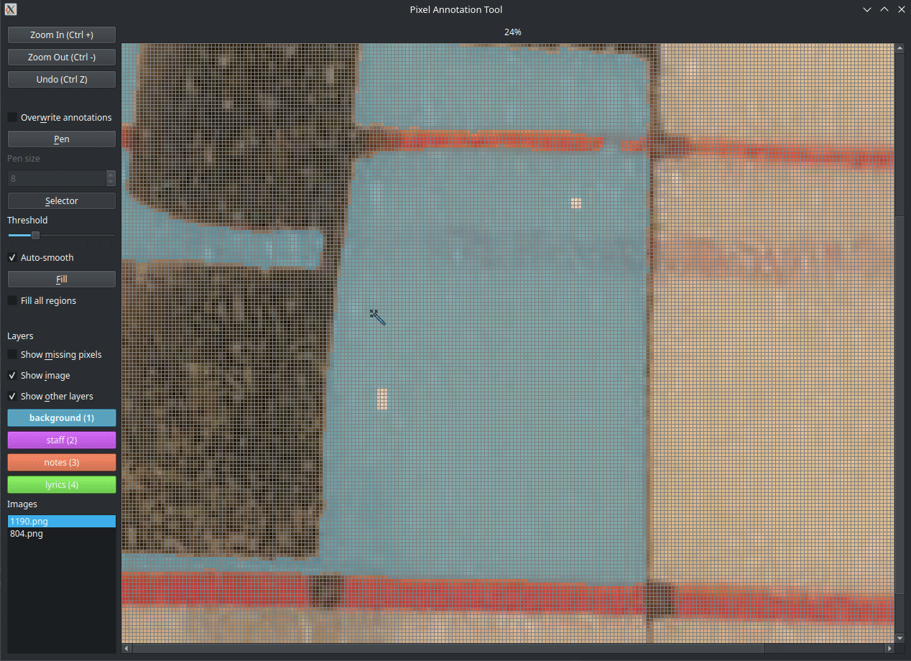
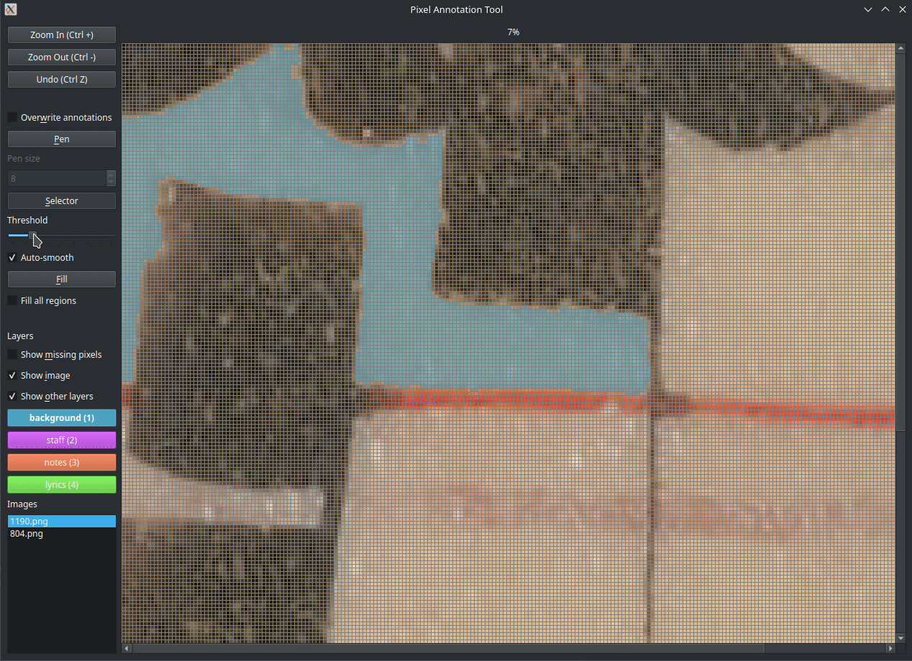
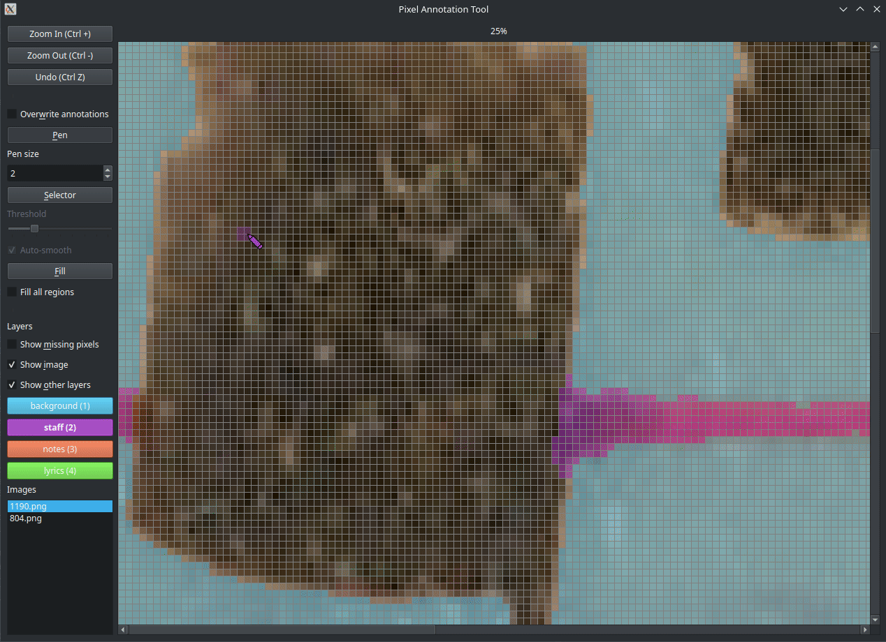

# Pixel-Level Annotator

A simple tool for pixel-by-pixel annotation of images, ideal for creating segmentation masks. The tool also tracks annotation time per layer.


## Running the application

Install the required libraries using pip:

```bash
pip install -r requirements.txt
```

Then, run the application:

```bash
python main.py
```

If the application fails to start with an error message related to the QT library such as:
`qt.qpa.plugin: Could not load the Qt platform plugin "xcb"`, you may need to reinstall the following packages:

```bash
sudo apt install --reinstall libxcb-xinerama0 libxcb-cursor0
sudo apt install --reinstall libxcb1 libx11-xcb1 libxrender1 libxkbcommon-x11-0
```

## Usage

1. Place your images in the `images` folder.
2. Edit `layers.txt` to define annotation layers:
    - Each line represents a layer.
    - Layers appear in order in the application and are assigned shortcut keys (1 to the total number of layers).
    - Optionally, specify a color in HEX format; otherwise, red is used by default.
3. Run `main.py` to start annotating.

A progress bar at the top indicates completion, aiming for 100%. 

Annotations are saved in `annotations`, with the following format for an image `image.png` with 4 layers:
- `image_0.png` to `image_3.png`: Grayscale images (one per layer).
- `image.metadata`: A text file tracking annotation time per layer.

Annotations and metadata are saved automatically. You can stop and resume at any time.

## General Controls

- **1, 2, ...**: Select layer
- **Wheel**: Scroll vertically
- **Shift + Wheel**: Scroll horizontally
- **Ctrl + Wheel**: Zoom in/out
- **Ctrl + + / -**: Zoom in/out
- **Space (hold)**: Hide annotations
- **w**: Overwrite annotations (toggle). When on, the tool will overwrite existing annotations.
- **m**: Highlight unannotated pixels
- **i**: Show/hide original image
- **o**: Show/hide other layers
- **Ctrl + Z**: Undo
- **p**: Pen tool
- **s**: Selector tool (magic wand)
- **f**: Fill tool

## Tools

### Pen Tool

- **Left Click**: Annotate pixels (hold and drag to draw)
- **+ / -**: Increase/decrease brush size



### Selector Tool (Magic Wand)

Creates a mask for selected pixels. Adjust selection and confirm with **Enter** to annotate.

- **Left Click**: Select neighboring pixels (flood fill)
- **Enter**: Confirm annotation
- **Esc / Ctrl + Z**: Cancel selection
- **+ / -**: Increase/decrease tolerance
- **e / r**: Expand/reduce selection
- **Auto-Smooth**: Fills small gaps automatically



### Fill Tool

- **Left Click**: Annotate an area with similar colors
- **Fill All Regions**: Annotate all unannotated regions in the selected layer


